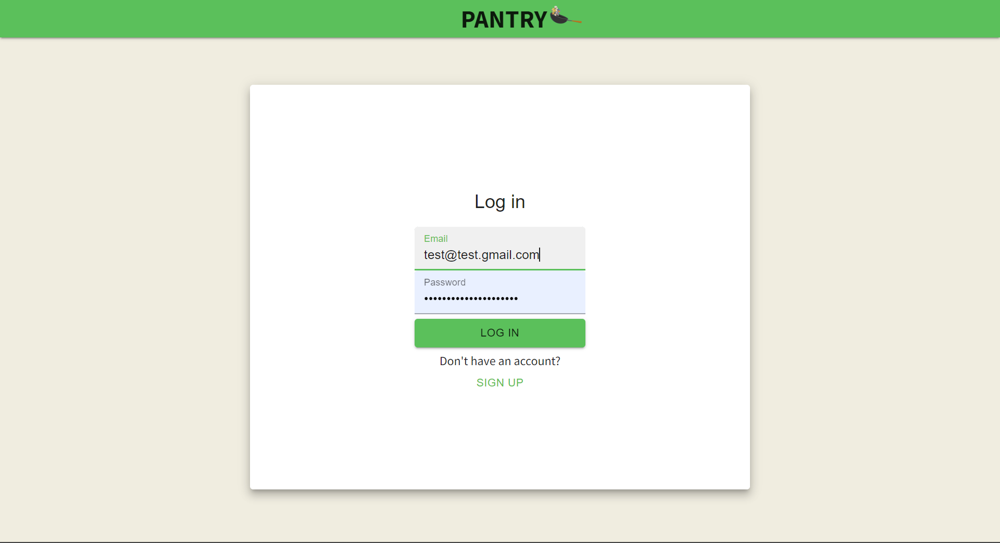
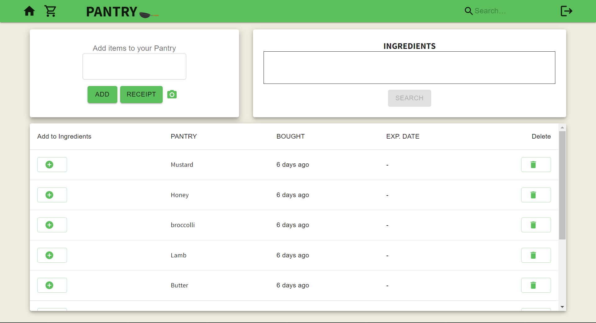
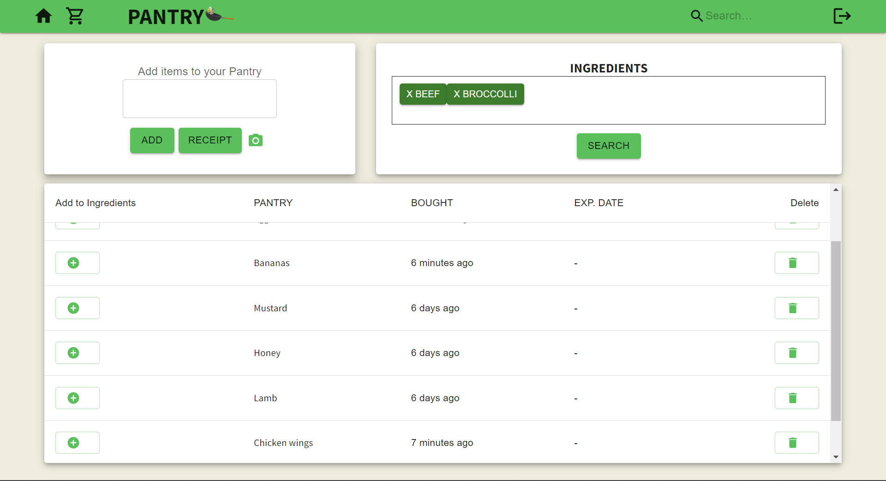
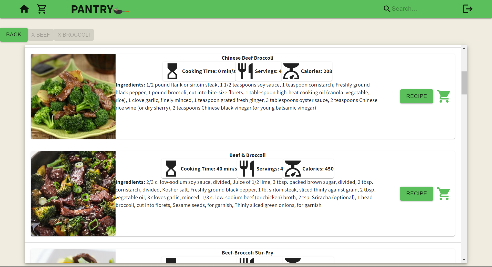
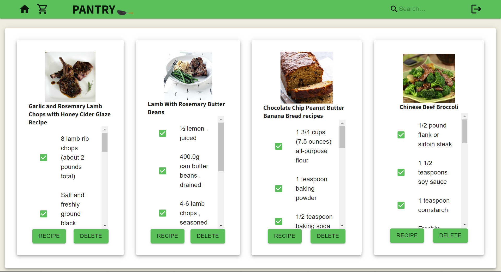

# PANTRY-APP
Pantry inventory and recipe finder full-stack application.

- Login Page

- Home Page

- Add Ingredients to search for recipes

- Look for recipes with your ingredients

- Click the cart button to get the ingredients lists

## Bugs
- Buttons not loading the page with the most recent information.
- Checkbox renders all items pre-checked.
- Link buttons loads the page to the link.
- Cooking time only translates to minutes.

## Features
- Server is not that strict on mispells and spacing of food items.

## Installation

- Install the packages with `npm i`
- npm start
